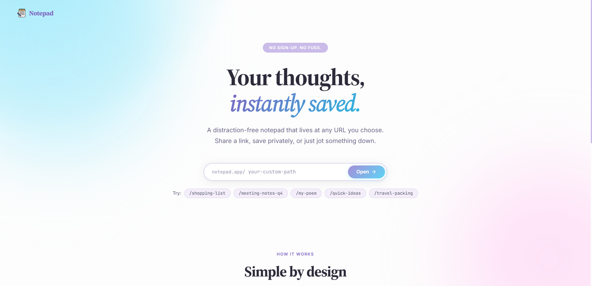
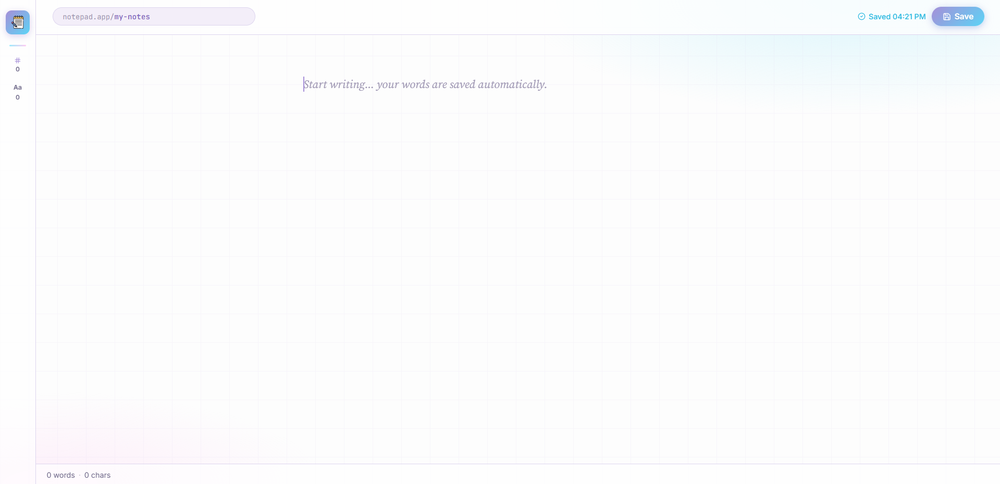
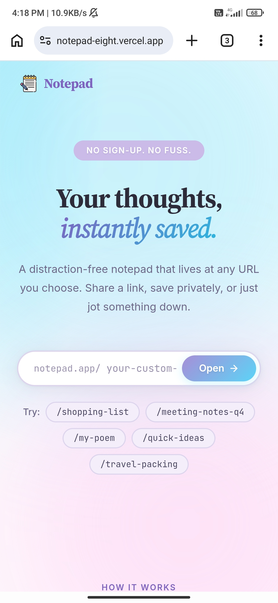
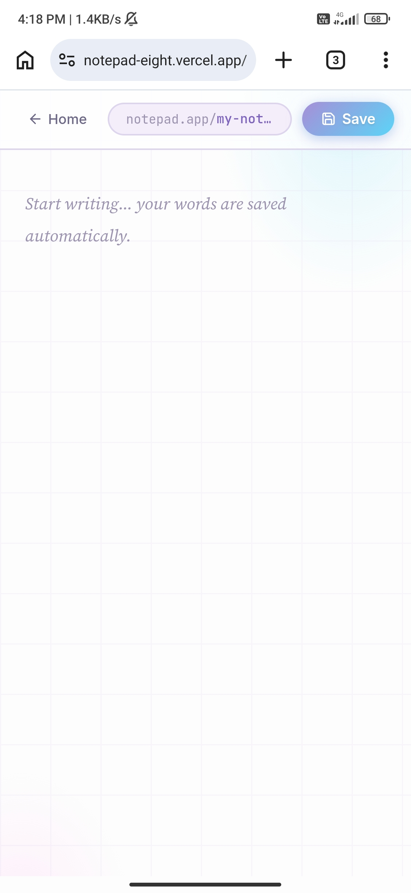

<div align="center">


<br/><br/>

# 📝 Notepad

**A clean, distraction-free notepad that lives at any URL.**  
Navigate to a custom path, start typing instantly, and your thoughts are auto-saved to the cloud.

<br/>

[**Demo / Live Site**](https://notepad-eight.vercel.app) &nbsp;·&nbsp; [Report Bug](../../issues) &nbsp;·&nbsp; [Request Feature](../../issues)

</div>

---

## 📸 Screenshots

<div align="center">
<table>
  <tr>
    <td align="center">
      <br/>
      <sub><b>Home (Desktop)</b></sub>
    </td>
    <td align="center">
      <br/>
      <sub><b>Editor (Desktop)</b></sub>
    </td>
  </tr>
  <tr>
    <td align="center">
      <br/>
      <sub><b>Home (Mobile)</b></sub>
    </td>
    <td align="center">
      <br/>
      <sub><b>Editor (Mobile)</b></sub>
    </td>
  </tr>
</table>
</div>

---

## ✨ Features

- ⚡ &nbsp;**Instant Access** — Navigate to any URL (e.g., `notepad.app/my-ideas`) to immediately open your notebook.
- ☁️ &nbsp;**Auto-Save** — Everything you write is synced to the cloud a second after you stop typing.
- 🎨 &nbsp;**Beautiful UI** — Clean pastel theme (`sky`, `lavender`, `pink`) designed to stay out of your way.
- 🔒 &nbsp;**Privacy by Obscurity** — Use a long, unguessable path as your password (e.g., `/q7x-morning-thoughts-2026`).
- 📊 &nbsp;**Live Tracking** — Clean word and character count stats updated in real-time.

---

## 📦 Download & Install

```bash
# Clone the repository
git clone https://github.com/soares-roydon/notepad.git
cd notepad

# Navigate to the frontend directory
cd frontend

# Install dependencies and run locally
npm install
npm run dev
```

The app will be running at `http://localhost:5173/`.

---

## 🛠️ Tech Stack

| Layer | Technology |
|---|---|
| Framework | React v19 |
| Bundler | Vite |
| Routing | `react-router-dom` |
| UI/Icons | Vanilla CSS + `lucide-react` |
| Backend | Node.js / Express (`https://notepad-awzd.onrender.com`) |

---

## 🗂️ Project Structure

```
frontend/
├── index.html
├── src/
│   ├── main.jsx             # Entry point
│   ├── App.jsx              # Router setup
│   ├── index.css            # Global pastel theme tokens
│   ├── pages/
│   │   ├── Home.jsx         # Landing page & URL picker
│   │   └── Notepad.jsx      # Auto-saving editor view
│   └── styles/
│       ├── Home.css         # Hero and landing styling
│       └── Notepad.css      # Editor and glassmorphism styling
```

---

## 📄 License

```
MIT License

Copyright (c) 2026 soares-roydon

Permission is hereby granted, free of charge, to any person obtaining a copy
of this software and associated documentation files (the "Software"), to deal
in the Software without restriction, including without limitation the rights
to use, copy, modify, merge, publish, distribute, sublicense, and/or sell
copies of the Software, and to permit persons to whom the Software is
furnished to do so, subject to the following conditions:

The above copyright notice and this permission notice shall be included in all
copies or substantial portions of the Software.

THE SOFTWARE IS PROVIDED "AS IS", WITHOUT WARRANTY OF ANY KIND, EXPRESS OR
IMPLIED, INCLUDING BUT NOT LIMITED TO THE WARRANTIES OF MERCHANTABILITY,
FITNESS FOR A PARTICULAR PURPOSE AND NONINFRINGEMENT.
```
